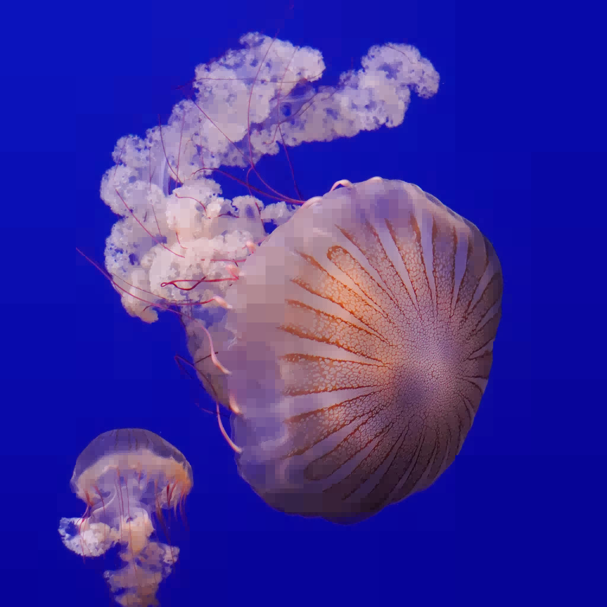
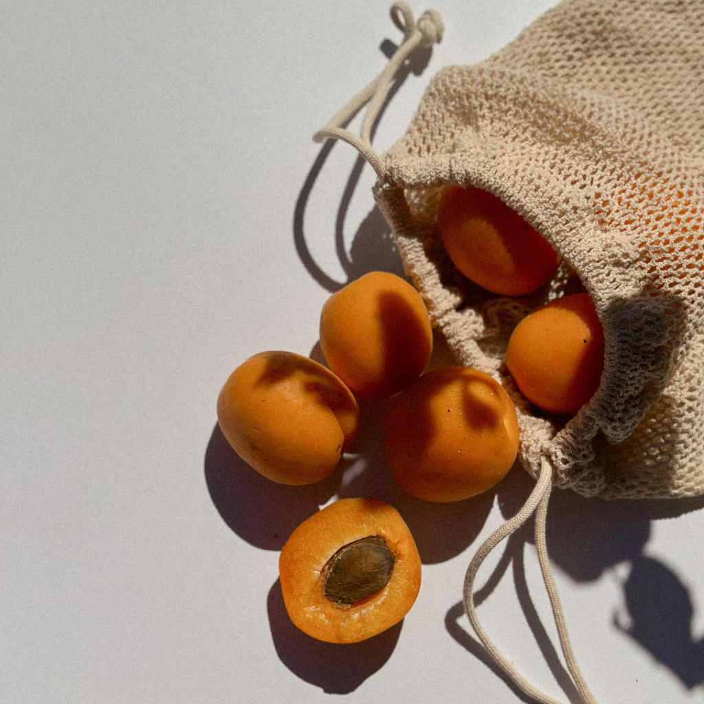
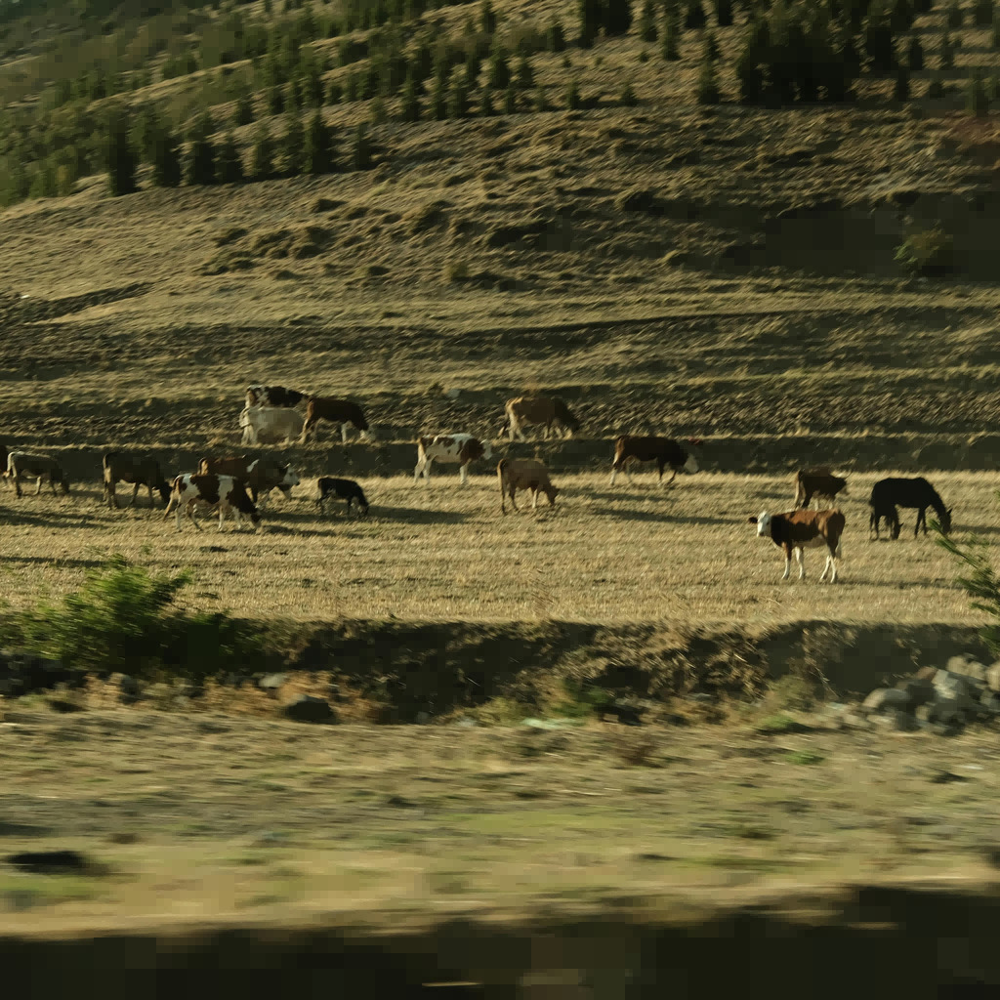
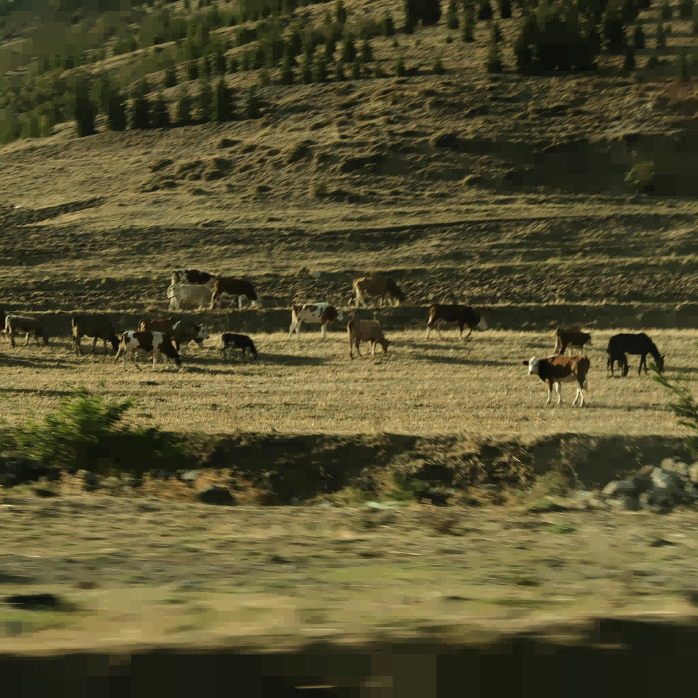

## Benchmarking Report
---

The images used for the tests are from [Pexels](https://www.pexels.com/ro-ro/).

While by using this application you can get virtually up to a 99.999% compression rate (if we are talking about monochromatic high-resolution images which will always be only 8kb in compressed form), I did some testing to find out the application's capabilities in real-life situations.

Using 20 complex images with 1024x1024 dimensions, I reached the following conclusions:
- 16/20 images were larger in compressed form when using the compression factor 0 due to the additional information required for constructing back the compression tree(since the majority of the images used didn't have large portions with the exact same hue)
- using a compression factor of __10__, 18/20 images were smaller in compressed form, ___reaching up to 80% compression___
- using a compression factor of __25__, 19/20 images were smaller in compressed form, ___reaching up to 87% compression___
- using a  compression factor of __50__, all the images were smaller in compressed form, ___reaching up to 91% compression___

_Note_: The script ``benchmark.sh`` can be used for benchmarking ppm images. PPM pictures aren't included in this repo, since they cannot be previsualized on Github. For converting jpg to ppm p6 images I wrote the script ``convert.sh``.

---

### __My results__

---

__TEST00__

   

``Compression factor 0: 140.97%
Compression factor 10: 107.00%
Compression factor 25: 65.28%
Compression factor 50: 21.81%
``

__TEST01__

   

``Compression factor 0: 120.04%
Compression factor 10: 24.13%
Compression factor 25: 13.11%
Compression factor 50: 8.77%
``

__TEST02__

   

``Compression factor 0: 128.00%
Compression factor 10: 80.19%
Compression factor 25: 64.70%
Compression factor 50: 53.28%
``

__TEST03__

   

``Compression factor 0: 127.20%
Compression factor 10: 85.49%
Compression factor 25: 71.53%
Compression factor 50: 61.26%
``

__TEST04__

   

``Compression factor 0: 83.36%
Compression factor 10: 34.14%
Compression factor 25: 26.31%
Compression factor 50: 22.21%
``

__TEST05__

   

``Compression factor 0: 99.11%
Compression factor 10: 24.77%
Compression factor 25: 12.99%
Compression factor 50: 7.27%
``

__TEST06__

   

``Compression factor 0: 136.53%
Compression factor 10: 37.7%
Compression factor 25: 23.91%
Compression factor 50: 15.94%
``

__TEST07__

   

``Compression factor 0: 123.35%
Compression factor 10: 20.00%
Compression factor 25: 14.66%
Compression factor 50: 11.25%
``

__TEST08__

   

``Compression factor 0: 124.93%
Compression factor 10: 43.57%
Compression factor 25: 28.60%
Compression factor 50: 19.02%
``

__TEST09__

   

``Compression factor 0: 140.36%
Compression factor 10: 67.38%
Compression factor 25: 37.85%
Compression factor 50: 27.94%
``

__TEST10__

   

``Compression factor 0: 92.92%
Compression factor 10: 33.96%
Compression factor 25: 25.41%
Compression factor 50: 19.44%
``

__TEST11__

   

``Compression factor 0: 138.08%
Compression factor 10: 53.58%
Compression factor 25: 30.17%
Compression factor 50: 18.77%
``

__TEST12__

   

``Compression factor 0: 70.15%
Compression factor 10: 41.72%
Compression factor 25: 33.35%
Compression factor 50: 25.61%
``

__TEST13__

   

``Compression factor 0: 143.11%
Compression factor 10: 95.37%
Compression factor 25: 35.79%
Compression factor 50: 24.19%
``

__TEST14__

   

``Compression factor 0: 136.51%
Compression factor 10: 88.12%
Compression factor 25: 65.27%
Compression factor 50: 47.32%
``

__TEST15__

   

``Compression factor 0: 137.09%
Compression factor 10: 120.34%
Compression factor 25: 111.09%
Compression factor 50: 98.60%
``

__TEST16__

   

``Compression factor 0: 123.74%
Compression factor 10: 56.39%
Compression factor 25: 38.83%
Compression factor 50: 28.88%
``

__TEST17__

   

``Compression factor 0: 103.41%
Compression factor 10: 74.61%
Compression factor 25: 60.59%
Compression factor 50: 48.82%
``

__TEST18__

   

``Compression factor 0: 134.87%
Compression factor 10: 24.42%
Compression factor 25: 13.59%
Compression factor 50: 9.07%
``

__TEST19__

   

``Compression factor 0: 141.16%
Compression factor 10: 95.46%
Compression factor 25: 75.48%
Compression factor 50: 57.51%
``

---